# Shadowsocks 教程：客户端篇

## Windows客户端安装配置

1. 下载安装

[点此下载](https://github.com/shadowsocks/shadowsocks-windows/releases/download/4.1.4/Shadowsocks-4.1.4.zip)Shadowsocks Windows客户端

下载后会得到一个zip压缩包，解压后会得到一个Shadowsocks.exe可执行文件，无需安装，双击即可运行。

2. 填写配置信息

运行后的界面如图：

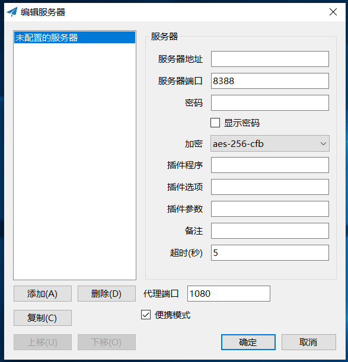

* 在服务器地址这里填写你的服务器地址;

* 服务器端口这里填写之前记住的shadowsocks服务端口号（那个介于 __1024__ 和 __65535__ 之间的数字）;

* 密码这里填写配置shadowsocks服务端时的设置的密码;

* 加密这里选择`chacha20-ietf-poly1305`；

* 备注这里随便填，相当于给这个服务器取个名字；

填写完之后点确定即可。

3. 启动服务

填写完配置信息后，在任务栏中可以看到一个小飞机图标，如图：

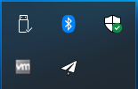

在小飞机图标上右键查看设置，如图：

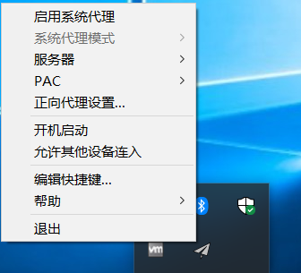

勾选上`启动系统代理`和`开机启动`即可。现在就可以打开浏览器试试能不能访问Google了。

## Linux客户端安装配置

Linux用户可以直接执行以下命令完成客户端配置：

```shell
sudo apt install curl -y && sudo sh -c "$(curl -fsSL https://raw.githubusercontent.com/nickyc975/shadowsocks-guide/master/scripts/deploy_client.sh)"
```

配置过程中需要输入三项信息：

1. 当提示`Input your server ip address: `时，输入你服务器的IP地址，然后按Enter；

2. 当提示`Input your server port: `时，输入你的shadowsocks服务的端口号，然后按Enter；

3. 当提示`Input your password: `时，输入shadowsocks服务的密码，然后按Enter；

当提示`Done!`时，配置就完成了，接下来只要配置好浏览器的代理，就可以顺利翻墙了。

## Chrome浏览器代理设置

由于在Linux系统下shadowsocks客户端只支持socks 5代理，所以安装配置好客户端之后还需要配置系统代理才能实现翻墙。不过鉴于通常是使用浏览器翻墙，所以也可以只配置浏览器的代理，不需要配置系统代理。这里就只介绍如何配置Chrome浏览器代理，关于配置系统代理可以参考[这里](https://blog.liuguofeng.com/p/4010)。

1. 安装SwitchyOmega

安装Chrome浏览器后，在终端下使用如下命令启动Chrome：

```shell
google-chrome-stable --proxy-server=socks5://127.0.0.1:1080
```

这将使得Chrome临时使用shadowsocks代理访问网络，即能够临时翻墙。

然后在Chrome里访问这个链接，下载安装[SwitchyOmega](https://chrome.google.com/webstore/detail/proxy-switchyomega/padekgcemlokbadohgkifijomclgjgif)，这是一个Chrome浏览器扩展，可以帮助你快速配置浏览器代理。

2. 设置代理

安装完SwitchyOmega之后会自动跳转到这个界面（如果提示查看教程，直接点`跳过教程`即可）：

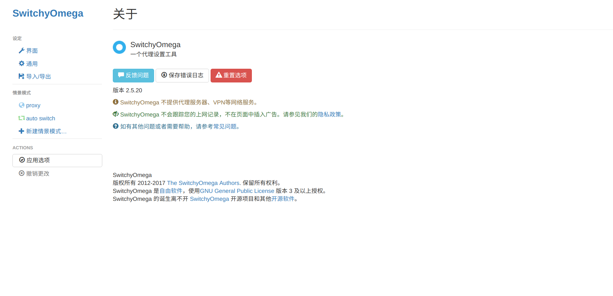

点击左侧的proxy，进入这个界面：

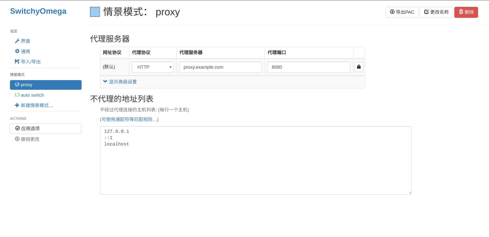

在这里我们可以就配置代理信息，具体如下：

* 代理协议选择`SOCKS5`；
* 代理服务器填`127.0.0.1`；
* 代理端口填`1080`；

填写完成后应该如图所示：

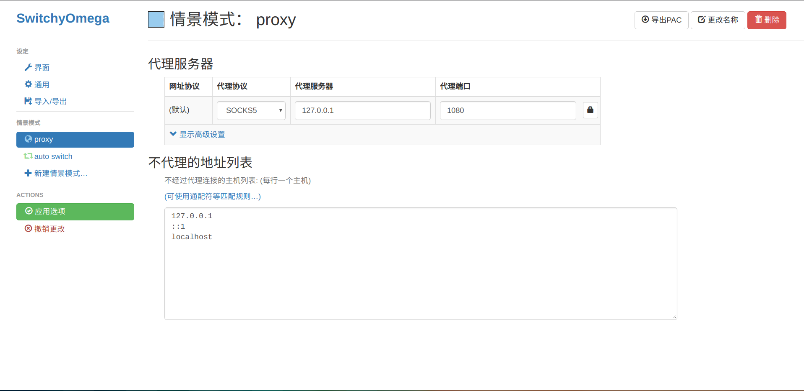

然后点击左侧的应用选项保存配置。

接下来配置代理规则，点击左侧的`auto switch`，可以看到如下界面：

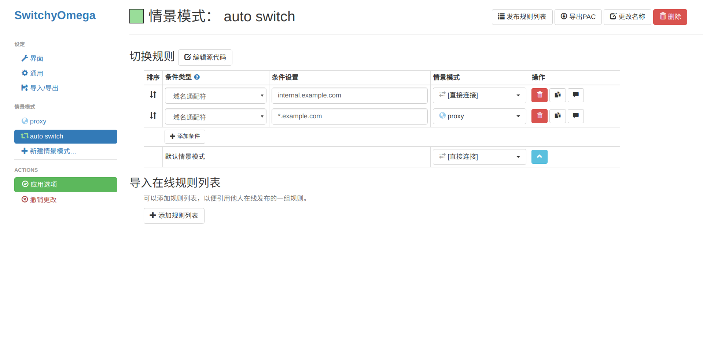

首先点击红色的删除键删除已有的两条规则，删除后如图：

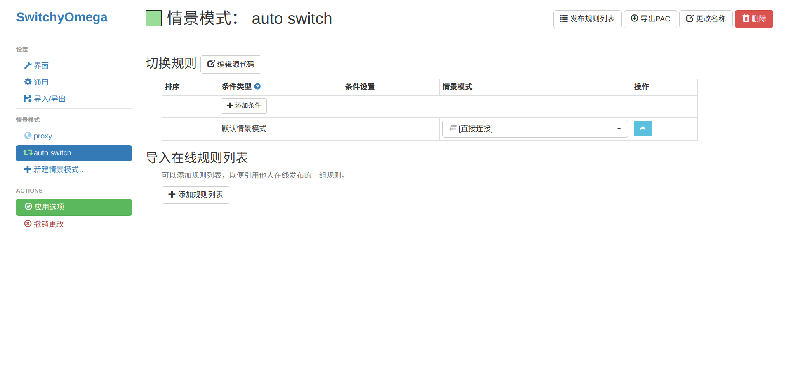

然后点击`导入在线规则列表`下方的`添加规则列表`，如图：

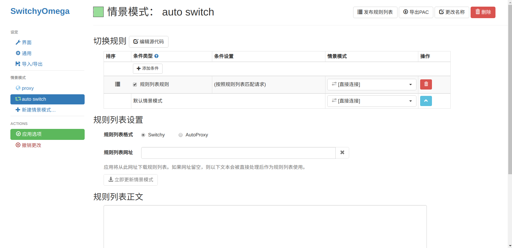

可以看到切换规则里自动生成了一个`规则列表规则`，接下来按如下规则填写：

* `规则列表规则`那一行的`情景模式`列选择`proxy`；
* `规则列表格式`选`AutoProxy`；
* `规则列表网址`填这个链接：`https://raw.githubusercontent.com/gfwlist/gfwlist/master/gfwlist.txt`

填写完后先点`应用选项`，再点`立即更新情景模式`，等更新完成后界面如图：

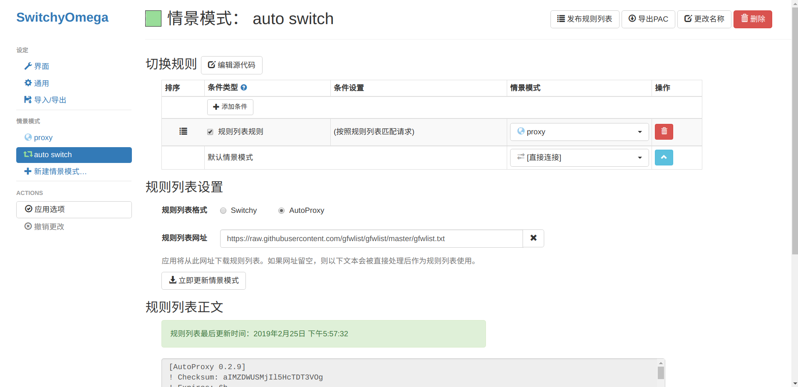

到这里，浏览器的代理设置就搞定了。现在关掉Chrome浏览器并通过桌面图标重新打开，然后点击浏览器右上角的SwitchyOmega的图标，选择`auto switch`，就可以正常访问被墙的网站了。

## Android客户端安装配置

首先从[这里](https://github.com/shadowsocks/shadowsocks-android/releases)下载安装最新的shadowsocks安卓客户端。如果你不知到该下哪个版本，那就下载`shadowsocks--universal-x.x.x.apk`，其中`x.x.x`是版本号。

安装之后打开shadowsocks，界面如图：

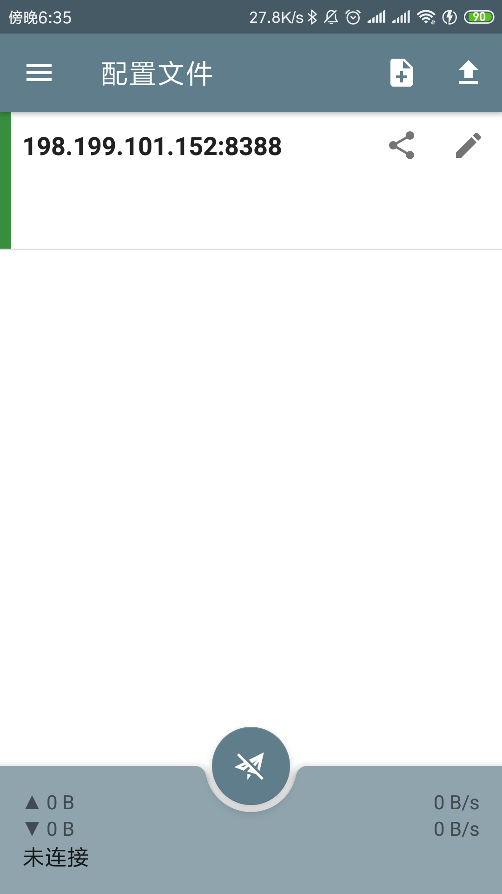

点击右上角的那个带加号的按钮，如图：

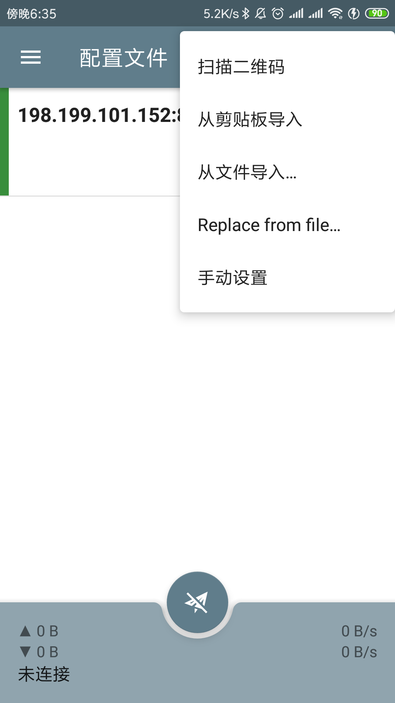

点击手动设置，进入设置界面，如图：

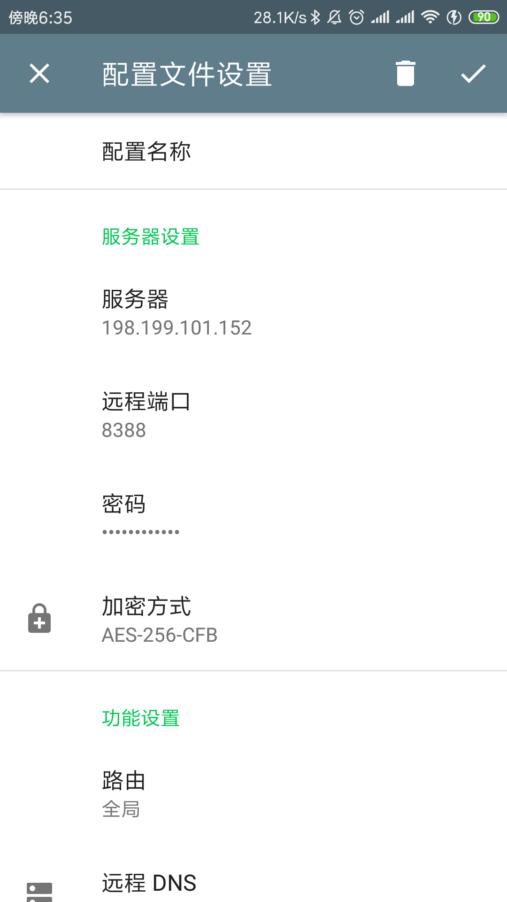

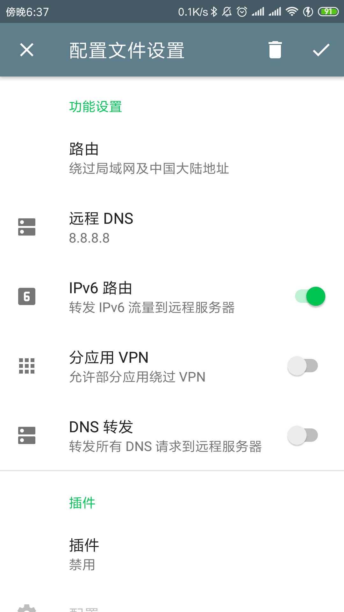

按照如下规则填写：

* `配置名称`随意填；

* `服务器`填你的服务器IP地址；

* `远程端口`填之前记住的shadowsocks服务端口号；

* `密码`填你设置的shadowsocks服务密码；

* `加密方式`选`CHACHA20-IETF-POLY1305`；

* `路由`选择`绕过局域网和中国大陆`；

然后点右上角的勾，保存设置并返回首页，这时你就能在首页看到刚才新建的配置了。如果你没有填配置名称的话，配置名称就是你的服务器IP地址。接下来选中你的服务器，然后点首页下方的圆形按钮即可启动代理。通常这个时候系统会提醒你是否建立VPN链接，直接选是即可。然后就可以正常访问被墙的网站了。