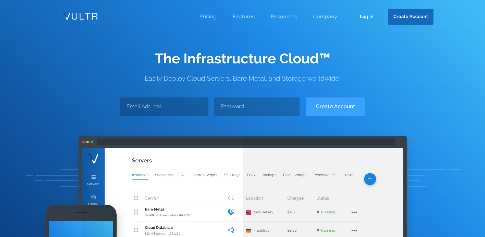
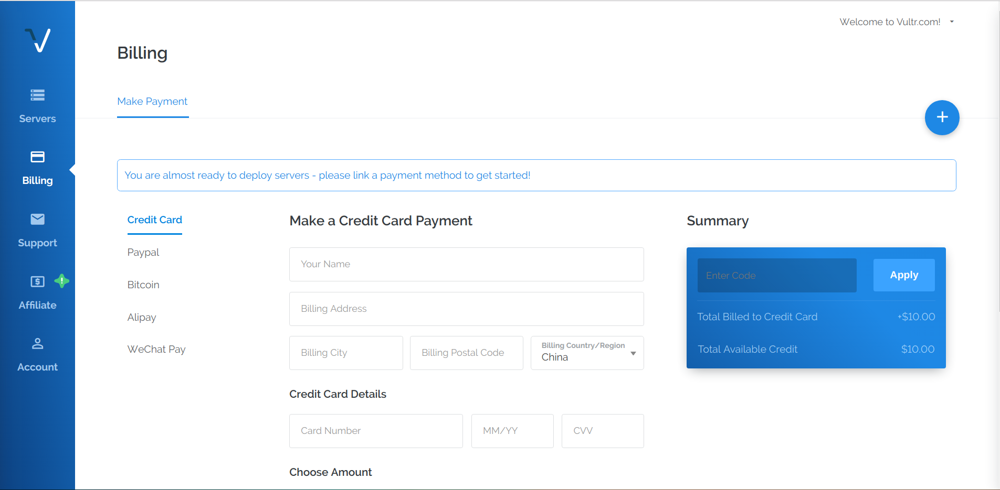
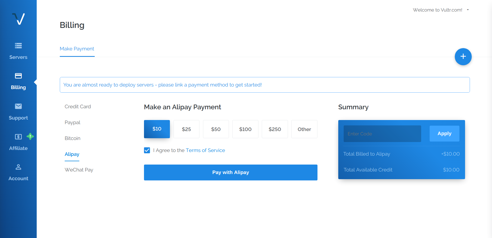
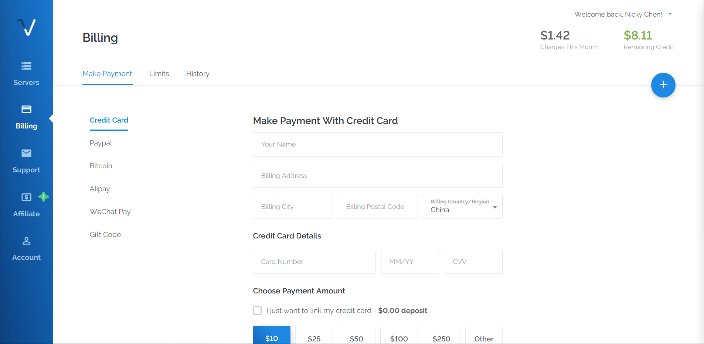

# Shadowsocks 教程：服务器篇

## 原理

简单来说，翻墙的原理就是利用一台墙外的服务器作为中介，让它在墙内的计算机和被屏蔽的网站之间转发数据，从而让墙内的计算机可以访问被屏蔽的网站。更详细的原理介绍可以看这里：[上网限制和翻墙基本原理](https://superxlcr.github.io/2018/07/01/%E4%B8%8A%E7%BD%91%E9%99%90%E5%88%B6%E5%92%8C%E7%BF%BB%E5%A2%99%E5%9F%BA%E6%9C%AC%E5%8E%9F%E7%90%86/)

## 购买服务器

根据翻墙原理我们可以知道，要想翻墙首先需要一台在墙外的服务器。

因为我们的目的是翻墙，所以对服务器的性能没什么要求，但是对网络要求比较高。通常选用VPS(Virtual Private Server 虚拟专用服务器)作为翻墙服务器。

国外的VPS提供商很多，比较知名的有Vultr，搬瓦工，Digital Ocean等，这里有一个比较详细的列表：[10美元以下国内VPS/美国VPS推荐](https://www.vpser.net/ten-dollars-vps)

以Vultr为例，Vultr支持使用支付宝和微信付款，对于国内用户比较方便。

1. 访问Vultr官网：[https://www.vultr.com/?ref=7858627-4F](https://www.vultr.com/?ref=7858627-4F)

    * 使用上面这个链接注册，可以直接获得50美元试用金，当你花了25美元后，我也可以获得25美元作为奖励。

2. 注册账户

在`Email Address`这里填写自己的邮箱地址（任何邮箱都可以），`Password`这里填写要创建的Vultr账号的密码，然后点击`Create Account`。之后你填写的邮箱会收到一封来自noreply@vultr.com的邮件，用于激活你的账号，点击邮件中的`Verify Your E-mail`激活即可。

3. 充值

上一步中点击`Create Account`后会自动跳转到这个界面：

以使用支付宝支付为例，点击`Alipay`，选中`I Agree to the Terms of Service`，界面如图：

选择你要充值的金额，如果没有你想充值的金额数，那就选择`Other`，然后了手动输入你要充值的金额。之后点击 `Pay with Alipay`，就会跳转到支付宝支付界面，美元会自动按照当前汇率换算成人民币，接下来使用手机扫码付款即可。

支付成功后在`Billing`界面就会显示你账户当前的余额数，如图所示：

右上角会展示你的账户余额，左边黑色的是本月的支出，右边绿色的是当前账户余额。

## 部署服务器

充值成功后就可以部署服务器了。服务器按实际运行时间收费，费用直接从你的账户余额中扣除。注意，即使将服务器关机依旧会正常收费，因为即使关机了也还占用着硬盘和IP地址等。要想停止计费只能将服务器销毁(Destroy)。